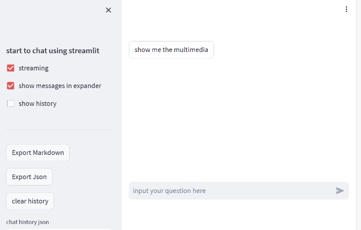
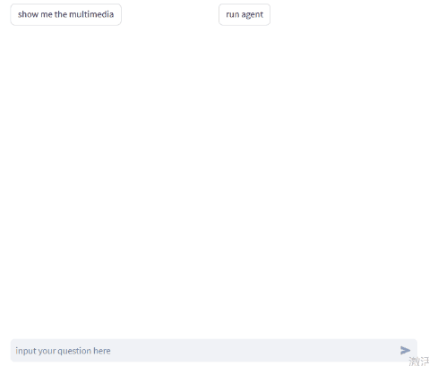

# Attention!

Since version 1.24.0 Streamlit provides official elements to [build conversational apps](https://docs.streamlit.io/knowledge-base/tutorials/build-conversational-apps).

The official elements are more flexible and better supported. Prefer them when you can.

However, Streamlit >= 1.23 requires protobuf >= 4 while some packages still need protobuf <= 3. In that case you can use this package (< 1.0.0) with Streamlit <= 1.22 as an alternative.

This package (>= 1.0.0) wraps the official chat elements to make LLM chat apps more convenient.

# Chatbox component for Streamlit

A Streamlit helper for chat UIs — basically a wrapper around the official chat elements.

- demo


- demo agent


## Features

- Streaming output
- Markdown / image / video / audio messages (extend via custom `OutputElement`)
- Multiple collapsible messages at once
- Session-state context bound to each conversation
- Export & import chat histories (Markdown / JSON)

This makes it easy to chat with LangChain LLMs in Streamlit.

See the [webui](https://github.com/chatchat-space/Langchain-Chatchat/blob/master/webui_pages/dialogue/dialogue.py) of [langchain-chatchat](https://github.com/chatchat-space/Langchain-Chatchat) for a real application.

## Install

```bash
pip install -U streamlit-chatbox
```

Local development:

```bash
cd streamlit-chatbox
pip install -e ".[dev]"
streamlit run example.py
pytest
```

## Usage examples

```python
import streamlit as st
from streamlit_chatbox import *
import time
import simplejson as json


llm = FakeLLM()
chat_box = ChatBox(
    use_rich_markdown=True,  # use streamlit-markdown
    user_theme="green",
    assistant_theme="blue",
)
chat_box.use_chat_name("chat1")  # add a chat conversation

def on_chat_change():
    chat_box.use_chat_name(st.session_state["chat_name"])
    chat_box.context_to_session()  # restore widgets when chat name changes


with st.sidebar:
    st.subheader("start to chat using streamlit")
    chat_name = st.selectbox("Chat Session:", ["default", "chat1"], key="chat_name", on_change=on_chat_change)
    chat_box.use_chat_name(chat_name)
    streaming = st.checkbox("streaming", key="streaming")
    in_expander = st.checkbox("show messages in expander", key="in_expander")
    show_history = st.checkbox("show session state", key="show_history")
    chat_box.context_from_session(exclude=["chat_name"])  # save widgets to chat context

    st.divider()
    btns = st.container()
    file = st.file_uploader("chat history json", type=["json"])

    if st.button("Load Json") and file:
        data = json.load(file)
        chat_box.from_dict(data)


chat_box.init_session()
chat_box.output_messages()

def on_feedback(feedback, chat_history_id: str = "", history_index: int = -1):
    reason = feedback["text"]
    score_int = chat_box.set_feedback(feedback=feedback, history_index=history_index)
    st.session_state["need_rerun"] = True


feedback_kwargs = {
    "feedback_type": "thumbs",
    "optional_text_label": "welcome to feedback",
}

if query := st.chat_input("input your question here"):
    chat_box.user_say(query)
    if streaming:
        generator = llm.chat_stream(query)
        elements = chat_box.ai_say(
            [
                Markdown("thinking", in_expander=in_expander, expanded=True, title="answer"),
                Markdown("", in_expander=in_expander, title="references"),
            ]
        )
        time.sleep(1)
        text = ""
        for x, docs in generator:
            text += x
            chat_box.update_msg(text, element_index=0, streaming=True)
        chat_box.update_msg(text, element_index=0, streaming=False, state="complete")
        chat_box.update_msg("\n\n".join(docs), element_index=1, streaming=False, state="complete")
        chat_history_id = "some id"
        chat_box.show_feedback(
            **feedback_kwargs,
            key=chat_history_id,
            on_submit=on_feedback,
            kwargs={"chat_history_id": chat_history_id, "history_index": len(chat_box.history) - 1},
        )
    else:
        text, docs = llm.chat(query)
        chat_box.ai_say(
            [
                Markdown(text, in_expander=in_expander, expanded=True, title="answer"),
                Markdown("\n\n".join(docs), in_expander=in_expander, title="references"),
            ]
        )

if btns.button("clear history"):
    chat_box.init_session(clear=True)
    st.rerun()
```

## Todos

- [x] Wrapper of official chat elements
- [ ] Richer input messages (depends on official `st.chat_input` improvements)
- [x] Output message types: Text / Markdown / Image / Audio / Video / Json
- [x] Streaming, expander, rich markdown, feedback
- [x] Export & import chat history
- [x] Fake agent demo output
- [x] Context bound to each chat

## Changelog

### v1.1.13

- Add Json output element
- Optional `streamlit-markdown` instead of `st.markdown`
- Register custom output methods with `ChatBox.register_output_method`

### Maintained fork notes

- Fixed JSON `from_dict` round-trip to match `to_dict`
- Fixed `context_to_session` include/exclude filtering
- Replaced deprecated `st.experimental_rerun` with `st.rerun`
- Removed unused `inputs/` (echarts stub) and empty `flows.py`
"# chatbox-streamlit" 
